# Tacho Quiz

## Table of Contents

- [Live Link](#live-link)  
- [Tacho Quiz Overview](#tacho-quiz-overview)  
- [Responsive App](#responsive-app)  
- [Accessibility](#accessibility)  
- [Suitability for Purpose](#suitability-for-purpose)  
- [Target Audience](#-target-audience)  
- [User Stories](#-user-stories)  
- [UX Design](#ux-design)  
  - [Strategy Plane](#1-strategy-plane)  
    - [Developer goals](#developer-goals)  
  - [Scope Plane](#2-scope-plane)  
    - [Excluded features](#excluded-features)  
  - [Structure Plane](#3-structure-plane)  
  - [Skeleton Plane](#4-skeleton-plane)  
  - [Surface Plane](#5-surface-plane)  
- [Image Presentation](#image-presentation)  
- [Navigation](#-navigation)  
- [Ease of Use](#-ease-of-use)  
- [Information Architecture](#information-architecture)  
- [Defensive Design](#defensive-design)
- [Responsive Design](#responsive-design)  
- [Colour Scheme & Typography](#colour-scheme-&-typography)  
- [HTML5 Usage](#html5-usage)  
- [CSS3 Usage](#css3-usage)  
- [Technologies Used](#-technologies-used)  
- [Deployment](#-deployment)  
  - [Deployment Steps](#deployment-steps)  
  - [Live Site](#live-site)  
- [Testing Implementation](#testing-implementation)  
  - [Functional testing](#1-functional-testing)  
  - [Responsive Testing](#2-responsive-testing)
  - [Browser Compatibility](#3-browser-compatibility)
  - [Input Validation Testing](#4-input-validation-testing)  
  - [Validation](#5-validation)
  - [Contrast & Accessibility Validation](#6-contrast--accessibility-validation) 
  - [Unfixed Bugs](#7-unfixed-bugs)  
- [Project Structure](#-project-structure)  
- [Images Source](#images-source)  
- [Wireframes](#wireframes)  
- [Bugs](#bugs)  
- [Version Control](#version-control)  
- [Comments in Code](#comments-in-code)  
- [Licence](#-licence)  
- [Future Enhancements](#future-enhancements)  

---

## Live Link

[Tacho-Quiz](https://11florin.github.io/tacho-quiz/)

---

## Tacho Quiz Overview

Tacho Quiz is a mobile‑first, browser‑based learning tool designed to help drivers and trainees improve their understanding of tachograph rules, driving limits, and rest regulations. The application delivers a clean, intuitive interface with one‑question‑at‑a‑time progression, instant feedback, and a fully responsive layout. Built as part of the Code Institute Full Stack Software Development programme, the project focuses on clarity, accessibility, and a smooth user experience across all devices.

---

## Responsive App

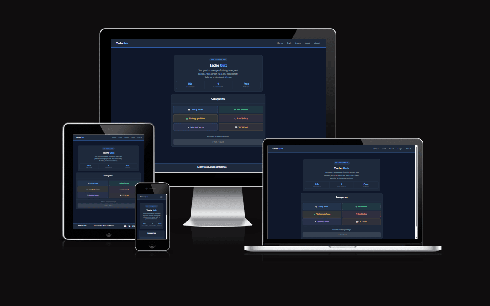

---

## Accessibility

Tacho Quiz follows core accessibility principles to provide a clear and comfortable experience for users. The interface uses a high‑contrast colour palette, readable typography, and large tap targets suitable for mobile devices. All images include descriptive alt text, and the layout is fully responsive across different screen sizes. The design avoids flashing elements or distracting animations, supporting users with visual or cognitive sensitivities.

---

## Suitability for Purpose
Tacho Quiz has been designed to meet the expectations and needs of its intended users. The interface is simple, distraction‑free, and optimised for mobile use, making it ideal for drivers and trainees who need quick access to learning tools. 
The quiz structure:
One question at a time, clear answer buttons, and instant feedback  ensures that users can focus without confusion.

The design choices support the project's purpose:

- Mobile‑first layout ensures accessibility for users who primarily study on their phones.
- Clear visual hierarchy helps users understand where to click and what to do next.
- Immediate feedback reinforces learning and keeps users engaged.
- Straightforward navigation prevents frustration and reduces cognitive load.

A typical user would not feel that "there is a much better way to do this", as the interface follows established UX conventions and avoids unnecessary complexity.

---

## 🎯 Target Audience

Tacho Quiz is designed for the following groups of users:
- Professional drivers preparing for CPC examinations
- New drivers who want to understand tachograph rules, driving times, and rest periods.
- Transport company trainees undergoing internal training programmes.
- Anyone interested in testing their knowledge of European road‑transport regulations.

The application is built using a mobile‑first approach, making it ideal for users who access the quiz on their phones during breaks or study sessions.

---
## 📚 User Stories (Summary)

- As a user, I want to start the quiz easily so that I can begin without confusion.
- As a user, I want to see one question at a time so that I can focus clearly.
- As a user, I want to select answers with a single click so that the quiz feels intuitive.
- As a user, I want immediate feedback so that I know if I was correct.
- As a user, I want to see my final score so that I can understand my performance.
- As a user, I want the quiz to work on mobile devices so that I can play anywhere.

---

## UX Design
### 1. Strategy Plane
The purpose of the project is to provide a fast, clear, and accessible quiz that helps users learn driving and rest regulations.
User goals:

- Start the quiz immediately
- Receive instant feedback
- View their final score
- Navigate easily between pages
#### Developer goals:
- Simple interface
- Clear structure
- Smooth mobile experience

### 2. Scope Plane
Included features:
- Question categories
- Randomised questions
- Instant feedback
- Final score
- Score history
- Explanations for answers
#### Excluded features:
- User accounts
- Online leaderboards
- Cloud saving

### 3. Structure Plane
Primary user flow:
- Home -> choose category
- Quiz -> answer questions + receive feedback
- Score -> view results + breakdown
- Optional -> Login / About

Navigation is linear and intuitive, preventing users from breaking the flow.

### 4. Skeleton Plane
Layout decisions:
- Mobile‑first
- Large, square buttons
- High contrast
- Centred text
- Consistent spacing

### 5. Surface Plane
- Dark, modern colour palette
- Highlight colours for feedback
- Clean sans‑serif fonts
- Minimalist icon set

---

## Image Presentation
- Consistent graphic style and colour
- Background never distracts from content
- Images maintain aspect ratio
- Optimised file sizes
- Alternative formats where needed

---

## 🧭 Navigation

Navigation throughout the site is designed to be intuitive and consistent:

- A persistent navigation bar is available across all pages.
- A mobile menu toggle allows easy access on small screens.
- Users never need the browser Back button to move through the site.
- All external links open in a new tab using target="_blank".
- No broken links all navigation paths were manually tested.
- Clear page structure ensures users always know where they are and where they can go next.

This approach ensures a smooth and predictable browsing experience.

---
 
## 😀 Ease of Use
- Intuitive interface requiring no documentation
- Tested with real users (friends/family)
- No aggressive pop‑ups
- No autoplay audio
- All inputs clearly labelled with placeholders
- Consistent UX patterns inspired by GoodUI
- Users maintain full control at all times

---

## Information Architecture

- Information is logically structured
- Clear headers for each section
- Straightforward, easy‑to‑read language
- Interactivity used where helpful (quiz, feedback)
- No content feels out of place

---

## Defensive Design
- Users cannot break the site through unexpected actions
- Forms handle invalid or empty input gracefully
- Back/Forward navigation does not break functionality
- No console errors during interaction
- Quiz logic prevents multiple answers or skipping

## Responsive Design
- Fully functional from 360px to 4K
- Mobile‑first CSS
- Media queries for tablet and desktop
- Responsive images maintaining aspect ratio
- Tested on Chrome, Firefox, Edge
---

## Colour Scheme & Typography
- Strong contrast between text and background
- Cohesive, modern colour palette
- Complementary sans‑serif fonts
- Text never overlaps images or backgrounds

--- 

## HTML5 Usage
- HTML validated using W3C Validator
- Semantic elements used appropriately (header, main, section, footer)
- All images include descriptive alt text
- Clean, consistent indentation
- Logical document structure

---

## CSS3 Usage
- Custom CSS demonstrating proficiency
- Validated using Jigsaw
- Organised into clear, commented sections
- No unnecessary duplication
- No inline CSS
- Consistent indentation

## 🛠️ Technologies Used

- **HTML5**
- **CSS3**
- **JavaScript (ES6+)**
- **Prettier** code formatter ensuring consistent styling across HTML, CSS, and JavaScript files
- **Git & GitHub** for version control
- **GitHub Pages** deployment of the live site
- **GitHub Copilot (VS Code)** AI‑assisted code suggestions and development workflow support
- **GitHub Copilot Code Review** automated pull‑request reviews and code quality insights
- **Claude** Quiz questions were AI-generated and manually reviewed for accuracy.

---

## 🚀 Deployment

The project is deployed using GitHub Pages.

### Deployment Steps

1. Open the GitHub repository
2. Go to Settings -> Pages
3. Select:  
- Branch: main  
- Folder: /docs  
4. Save

5. GitHub generates the live link

### Live Site

[tacho-quiz](https://11florin.github.io/tacho-quiz/)

---

## Testing Implementation

### 1. Functional testing

| Feature | Test Performed | Expected Result | Actual Result |
|--------|----------------|----------------|---------------|
| Start Quiz button | Click from home page | Quiz begins | Passed |
| Category selection | Select each category | Only selected category highlights | Passed |
| Answer buttons | Click each option | Feedback shown instantly | Passed |
| Score page | Finish quiz | Score and breakdown displayed | Passed |
| Navigation menu | Open/close on all pages | Menu toggles correctly | Passed |
| Login form | Submit empty fields | Error message shown | Passed |

### 2. Responsive Testing

Tested on:

- Android (Chrome, Firefox)
- iPhone (Safari)
- iPad
- Windows desktop (Chrome, Edge, Firefox)
- macOS (Safari, Chrome)

All layouts behaved correctly from 360px to 4K.

### 3. Browser Compatibility

- Chrome 
- Firefox 
- Edge 
- Safari 

### 4. Input Validation Testing

- Empty form fields
- Invalid email formats
- Rapid clicking
- Multiple answer attempts

All handled correctly.

### 5. Validation
**HTML Validation**  
- All HTML files were tested using the W3C Markup   Validation Service.  
- No errors were found.

**CSS Validation**
- The stylesheet passed the W3C CSS Validator with no errors.

**JavaScript (JSHint)**
- All JavaScript files were tested using JSHint.
- No major issues were reported. Minor ES6 warnings are expected and do not affect functionality.

**Lighthouse Testing**  
- Lighthouse was run in Chrome DevTools on the deployed site.

- Performance: 84
- Accessibility: 95
- Best Practices: 100
- SEO: 100

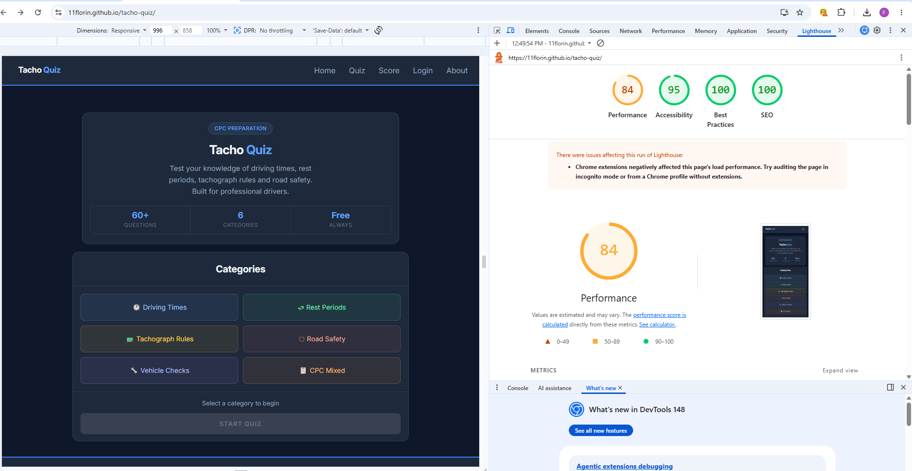

### 6. Contrast & Accessibility Validation
- All primary text, button, and feedback colour combinations were tested using the WebAIM Contrast Checker.
- All combinations passed WCAG 2.1 AA requirements, and several achieved AAA.

### 7. Unfixed Bugs

At the time of submission, no known unfixed bugs remain.

---

## 📁 Project Structure

TACHO-QUIZ/
|
| -- docs/
│   | -- assets/
│   │   |-- audio/
│   │   |-- css/
│   │   │   |-- style.css
│   │   |-- images/
│   │   │   |-- icons/
│   │   │   │   |-- android-chrome-192x192.png
│   │   │   │   |-- android-chrome-512x512.png
│   │   │   │   |-- apple-touch-icon.png
│   │   │   │   |-- favicon-16x16.png
│   │   │   │   |-- favicon-32x32.png
│   │   │   │   |-- favicon.ico
│   │   │   │   |-- site.webmanifest
│   │   │   |-- img/
│   │   │   │   |-- truck-img2.png
│   │   │   |-- logo/
│   │   │       |-- logo.png
|   |   |   |-- screenshot/
|   |   |       |-- screenshot.png
│   │   |-- js/
│   │       |-- index.js
│   │       |-- navbar.js
│   │       |-- questions.js
│   │       |-- quiz.js
│   │       |-- score.js
│   │
│   |-- wireframe/
│   │   |-- (wireframe images)
│   │
│   |-- about.html
│   |-- confirm.html
│   |-- index.html
│   |-- login.html
│   |-- quiz.html
│   |-- score.html
│
|-- LICENSE
|-- .gitignore
|-- README.md

---

## Images Source

- [Favicon base image sourced from](https://commons.wikimedia.org/wiki/File:Circle-icons-steeringwheel.svg)
- [truck img](https://commons.wikimedia.org/wiki/File:Gevara_refrigerator_truck_in_europe.jpg)

---

## Wireframes

Wireframes were created with the assistance of Claude AI (Anthropic)
based on my own design decisions and requirements.

The layout, structure, and content for each page were planned by me,
then rendered using Claude as a tool.

**Tools used:** Claude AI (claude.ai) for wireframe generation

### Mobile

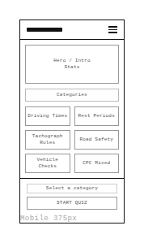
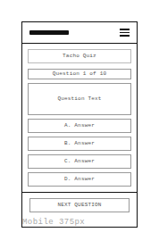
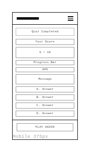
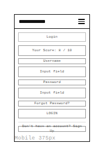
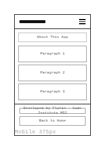

### Tablet

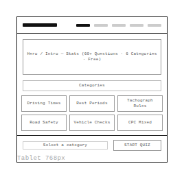
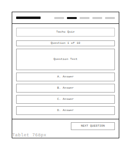
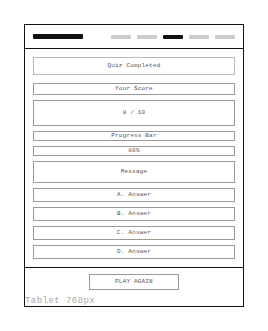
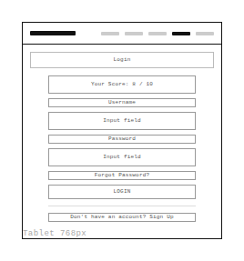
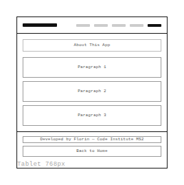

### Desktop

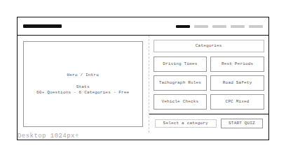
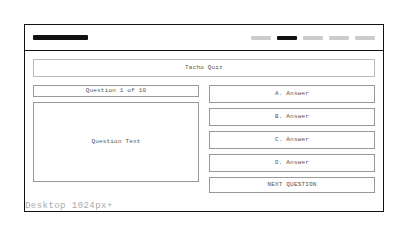
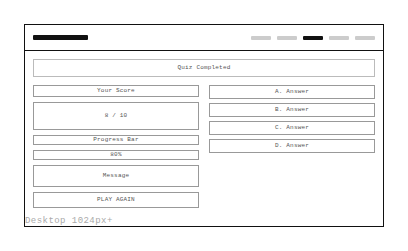
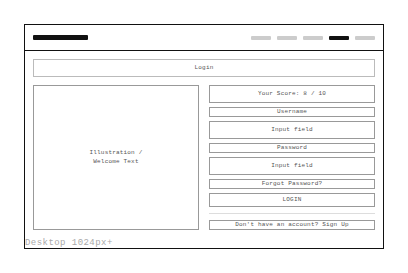
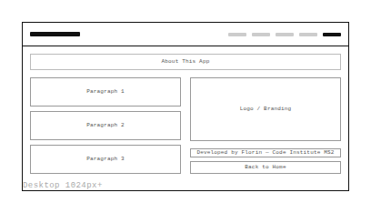

---

## Bugs
### 1. Unbalanced distribution of correct answers
**Issue:** Most questions originally had the correct answer set to option B, allowing users to guess without understanding.  
**Fix:** GitHub Copilot reorganised the answer keys to achieve a balanced distribution across A, B, C, and D.

### 2. Explanation box not displaying
**Issue:** The explanation element existed in the DOM but had no CSS styling, making it invisible.  
**Fix:** Added a dedicated .explanation-box class with styling and a subtle fade‑in animation.

### 3. Incorrect centring of the “forgot password” link
**Issue:** The element behaved like an inline element due to missing width, preventing proper centring.
**Fix:** Added width: 100% to .forgot-link to ensure consistent alignment.

### 4. Category selection triggering the wrong button
**Issue:** Selecting a category briefly activated the cpc-mixed button due to inconsistent clearing of previous selections.  
**Fix:** Updated the selection logic to remove all active states before applying the new one.

### 5. Mobile navbar remaining open invisibly
**Issue:** The mobile menu stayed active but hidden, causing unexpected clicks on underlying elements.  
**Fix:** Improved toggle logic so the menu closes correctly when clicking outside the navigation area.

### 6. Issues identified by GitHub Copilot Code Review
**Problems:**

inconsistent localStorage keys

unsafe JSON parsing

potential HTML injection

missing .breakdown-item.wrong styling

duplicate history entries

invalid score percentage values

**Fixes:**

standardised keys

added safe JSON fallback

replaced innerHTML with textContent

added missing CSS class

introduced tq_saved flag

validated and clamped score calculations

### 7. Inconsistent state handling and stale best‑score data
**Issue:** tq_category was cleared on page load, best‑score data was cached, and date formatting was inconsistent.  
**Fix:** Removed automatic clearing, re‑parsed best scores on each call, and standardised all dates to en‑GB.

### 8. Desktop navbar not stretching correctly
**Issue:** At widths above 1024px, the navbar did not span the full layout.  
**Fix:** Updated the desktop media query to ensure proper spacing and alignment.

---

## Version Control

Version control was managed using Git and GitHub throughout the development process.

- Frequent, meaningful commits were made for each feature, fix, or improvement.
- Commit messages follow a clear pattern ("Fix navbar toggle behaviour", "Add score breakdown logic").

---

## Comments in Code
Comments were added throughout the JavaScript and CSS files where relevant.

- Comments explain why certain decisions were made, not just what the code does.
- Complex logic (score calculation, category selection, localStorage handling) includes explanatory notes.

---

## 📄 Licence

This project is licensed under the **MIT Licence**.

---

## Future Enhancements

- Additional question / categories
- Sound effects toggle
- Animated transitions
